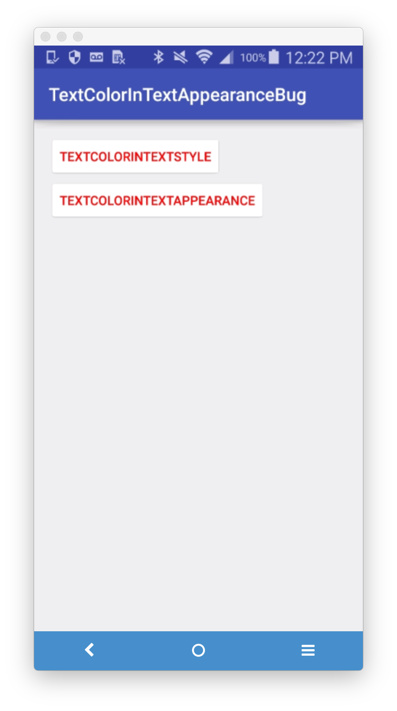
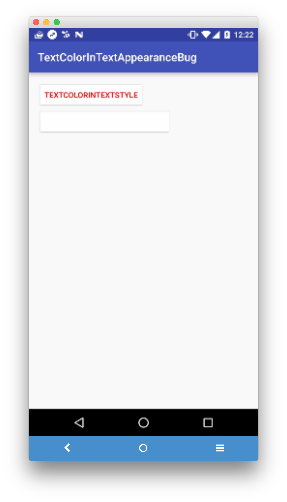

Check out `values/styles.xml` and `layout/activity_main.xml`

| Before Android N, a `textColor` defined in a `textAppearance` on a Colored button would work | Android N and later, `textColor` defined in a `textAppearance` on a Colored button do not work |
|----|----|
|  |  |